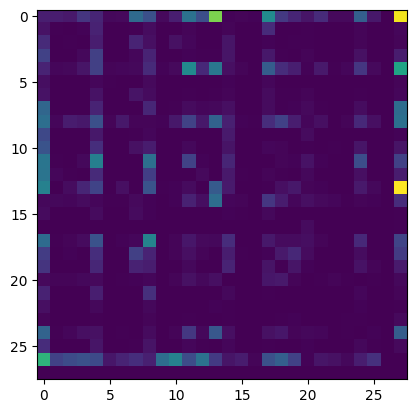
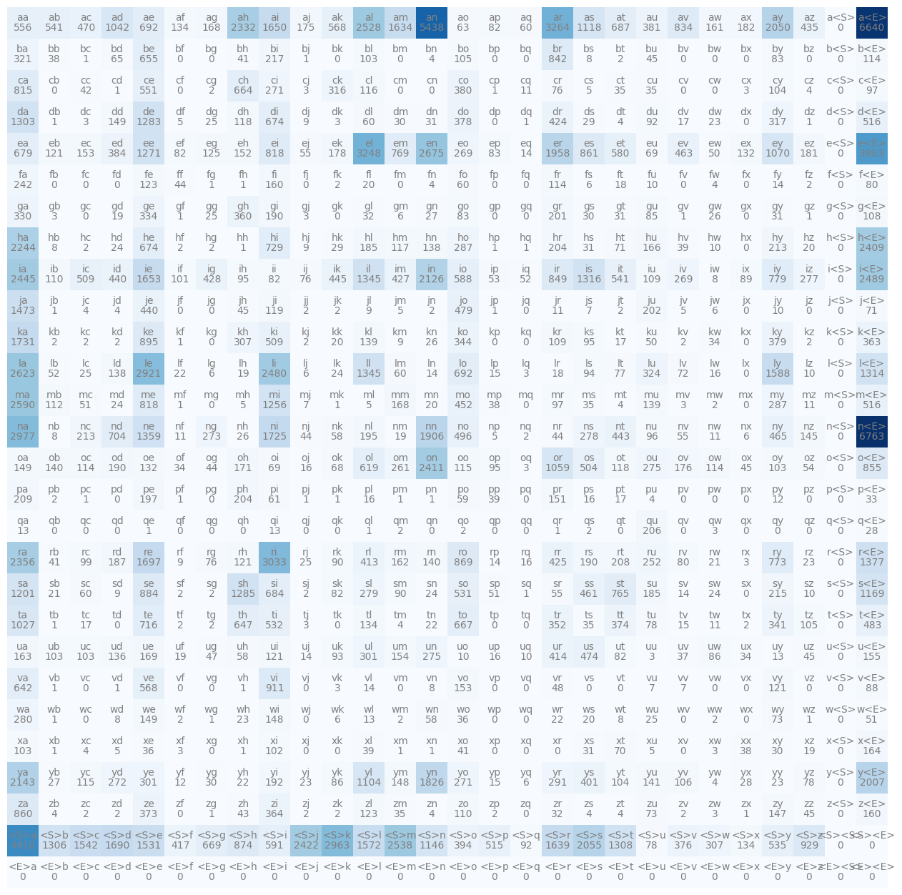
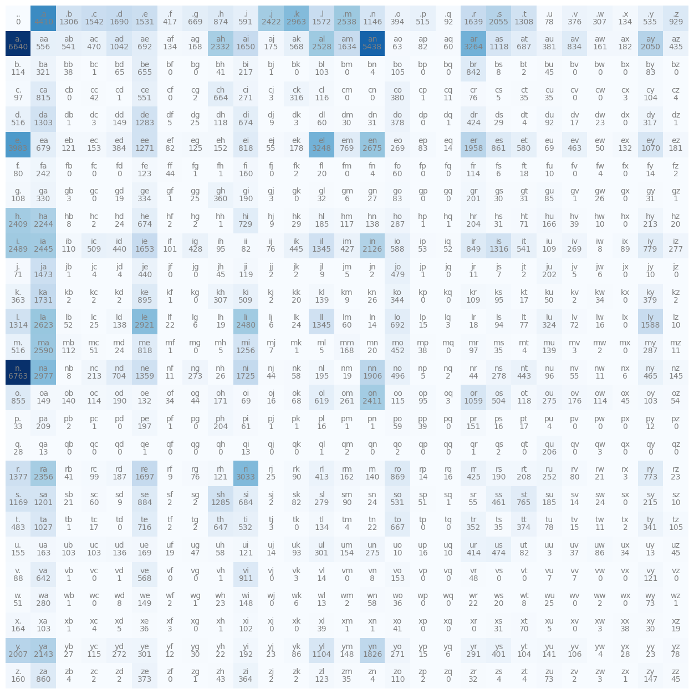

<script src="https://cdnjs.cloudflare.com/ajax/libs/mathjax/2.7.5/MathJax.js?config=TeX-MML-AM_CHTML" async></script>
<script type="text/x-mathjax-config">
MathJax.Hub.Config({
    tex2jax: {
        inlineMath: [['$','$'], ['\(','\)']],
        processEscapes: true
    }
});
</script>
## Bigram Language Model

Bigram model just models the most likely character to follow a given character. So, its two characters in a row - hence the name "bigram".


```python
words = open('makemore/names.txt').read().splitlines() # list of 32K names
```


```python
words[:10]
```


    ['emma',
     'olivia',
     'ava',
     'isabella',
     'sophia',
     'charlotte',
     'mia',
     'amelia',
     'harper',
     'evelyn']


```python
shortest = min(len(w)for w in words)
longest = max(len(w)for w in words)

print(f"Shortest name length: {shortest}, Longest name: {longest}")
```

    Shortest name length: 2, Longest name: 15


In the case of our name dataset, there is a lot packed into each name.  For our bigram model for e.g. the name "isabella" - it tells us that a name is most likely to start with "i" and end with "a".  It also tells us that the character "i" is most likely to be followed by "s" and then a "b".  Finally, we also know that after the last "a" the word ends.

We iterate through through each word, with a sliding window of 2 characters at a time.  We then use this data to train our bigram model.


```python
for w in words[:1]:
    for ch1, ch2 in zip(w, w[1:]):
        print(ch1, ch2)
```

    e m
    m m
    m a


So our code snippet above prints out bigrams for the word "emma".

We can see that the bigram "e m" appears 3 times, "m m" appears 1 time, and "a " appears 2 times.

We can use this data to train our bigram model.

But we need to take into account the beginning and end of the word.  We can do this by adding a special start and end character to the beginning and end of each word.


```python
for w in words[:2]:
    chs = ['<S>'] + list(w) + ['<E>'] # we add special start and end characters
    for ch1, ch2 in zip(chs, chs[1:]):
        print(ch1, ch2)

```

    <S> e
    e m
    m m
    m a
    a <E>
    <S> o
    o l
    l i
    i v
    v i
    i a
    a <E>


So our bigrams have expanded to include bigrames with the start and end characters.

Now we are going to count the frequency of each bigram in our dataset and record that in a dictionary.


```python
b = {}
for w in words:
    chs = ['<S>'] + list(w) + ['<E>'] # we add special start and end characters
    for ch1, ch2 in zip(chs, chs[1:]):
        bigram = (ch1, ch2)
        b[bigram] = b.get(bigram, 0) + 1
```

Now the dictionary `b` contains the frequency of each bigram in our dataset.


```python
print(b[('a', 'n')])
print(b[('e', 'm')])
```

    5438
    769


The bigram `('a', 'n')` appears 5438 times in our dataset and the bigram `('e', 'm')` appears 769 times.

We can sort the bigrams by frequency to get the most common bigrams.


```python
sorted_bigrams = sorted(b.items(), key=lambda kv: -kv[1])
print(sorted_bigrams[:5])
```

    [(('n', '<E>'), 6763), (('a', '<E>'), 6640), (('a', 'n'), 5438), (('<S>', 'a'), 4410), (('e', '<E>'), 3983)]


It is more efficient to store the bigrams in a 2D array.  To do this we will use pytorch tensor.

We have 26 characters and 27 start and end characters, so we will need a 28 x 28 tensor to store the bigrams.


```python
import torch
```


```python
N = torch.zeros((28, 28), dtype=torch.int32)
```


```python
# lookup table for our characters
chars = sorted(list(set(''.join(words))))
# string to integer mapping
stoi = {s: i for i, s in enumerate(chars)}
stoi['<S>'] = 26
stoi['<E>'] = 27

# encode the entire names dataset
for w in words:
    chs = ['<S>'] + list(w) + ['<E>']
    for ch1, ch2 in zip(chs, chs[1:]):
        ix1 = stoi[ch1]
        ix2 = stoi[ch2]
        N[ix1, ix2] += 1
```


```python
import matplotlib.pyplot as plt
%matplotlib inline

plt.imshow(N) # do a heat map of the bigram 28x28 tensor
```


    <matplotlib.image.AxesImage at 0x124d57bf0>


    

    


Lets do a clearer image.  The image above is nice, but still hard to visualize


```python
itos = {i: s for s, i in stoi.items()}

plt.figure(figsize=(16,16))
plt.imshow(N, cmap='Blues')
for i in range(28):
    for j in range(28):
        chstr = itos[i] + itos[j]
        plt.text(j, i, chstr, ha='center', va='bottom', color='gray')
        plt.text(j, i, N[i, j].item(), ha='center', va='top', color='gray')
plt.axis('off');
plt.show()
```


    

    


```python
N = torch.zeros((27, 27), dtype=torch.int32)

# lookup table for our characters
chars = sorted(list(set(''.join(words))))
# string to integer mapping
stoi = {s: i+1 for i, s in enumerate(chars)}
stoi['.'] = 0
# print(stoi)

# encode the entire names dataset
for w in words:
    chs = ['.'] + list(w) + ['.']
    for ch1, ch2 in zip(chs, chs[1:]):
        ix1 = stoi[ch1]
        ix2 = stoi[ch2]
        N[ix1, ix2] += 1

itos = {i: s for s, i in stoi.items()}
# print(itos)
plt.figure(figsize=(16,16))
plt.imshow(N, cmap='Blues')
for i in range(27):
    for j in range(27):
        chstr = itos[i] + itos[j]
        plt.text(j, i, chstr, ha='center', va='bottom', color='gray')
        plt.text(j, i, N[i, j].item(), ha='center', va='top', color='gray')
plt.axis('off')
plt.show()
```


    

    


Now in our 27 x 27 tensor, we have the frequency of each bigram in our dataset.

The first row represents how many times each letter in the alphabet starts a name.  The first column represents how many times each letter in the alphabet ends a name. (_Note: there is a ''.' character before and after the letter respectively_)

#### Sampling from the model

Now that we've "trained" our bigram model (by creating a tensor of letter bigram frequencies), we can use it to create new names. Here's how it works:

1. We calculate the probabilities for each letter in the alphabet based on the frequency of each bigram in our tensor.

2. We then normalize these probabilities so that they sum to 1. This means that the sum of the probabilities for all possible next characters is 1.

3. We then randomly choose a character based on these probabilities. It's kind of like rolling a weighted dice, where some numbers are more likely to come up than others.

4. The model looks at this character and gives us probabilities for what the next character might be. It's like the model is saying, "Based on what I've learned, here's how likely each letter is to come next."

5. We then randomly choose a character based on these probabilities. It's kind of like rolling a weighted dice, where some numbers are more likely to come up than others.

6. We add this new character to our name and repeat steps 2 and 3.

7. We keep doing this until we randomly choose the special character that represents the end of a name.

This process is called "sampling" because we're taking samples from the probabilities our model has learned. Each time we do this, we might get a different name, just like how you might get different results each time you roll a dice.

The names we generate this way should look similar to the names in our original dataset, but they won't be exact copies. Some might even be completely new names that weren't in our original data!

To choose a letter based on the probabilities our model gives us, we'll use a special tool in PyTorch called `torch.multinomial`. This function is like a smart dice roller that can handle our weighted probabilities. It helps us pick letters according to how likely the model thinks they are to appear next. 

We first calculate the probabilities for each letter (per row in our tensor above).  Then we use the `torch.multinomial` function to sample from the distribution.  In this case sampling means it will pick letters according to the probabilities in each row.. So for e.g if the probablity of the leter 'm' (actually '.m' biagram) is 30%, then it will sample "m" at least 3 times


```python
# Given N = torch.zeros((27, 27), dtype=torch.int32)
P = (N+1000).float()
P /= P.sum(1, keepdim=True)

# we can sample from this distribution
g = torch.Generator().manual_seed(2147483648)

for i in range(5):
    out = []
    ix = 0
    while True:
        p = P[ix]
        ix = torch.multinomial(p, num_samples=1, replacement=True, generator=g).item()
        out.append(itos[ix])
        if ix == 0:
            break
    print(''.join(out))
```

#### Loss Function

Our goal is to evaluate our bigram model to get a single number that tells us how well it's doing.  This is how we can do it.

1. We want to increase the likelihood that our model predicts the correct next letter in a name. This is like saying we want the model to be more confident in its correct guesses.

2. We use something called "log likelihood" instead of just likelihood. It's easier to work with mathematically, but it gives us the same result because of how logarithms work.
    - likelihood is basically the product of the probabilities of each letter in the name (ie. for each row in our tensor above)
    - log likelihood is the sum of the logarithms of the probabilities of each letter in the name (because $log(a*b) = log(a) + log(b)$)
    - log likelihood is easier to work with mathematically

3. To make our calculations simpler, we actually try to decrease the negative log likelihood. This is the same as increasing the regular log likelihood, just looked at from the opposite direction.

4. Finally, we take the average of this negative log likelihood across all our predictions. This gives us a single number that tells us how well our model is doing overall. The closer this number is to zero, the better our model is at predicting names.

The lower this final number is, the better our model is at predicting names. We call this number our "loss", and our job is to make it as small as possible.


```python
log_likelihood = 0.0
n = 0
for w in words:
    chs = ['.'] + list(w) + ['.']
    for ch1, ch2 in zip(chs, chs[1:]):
        ix1 = stoi[ch1]
        ix2 = stoi[ch2]
        prob = P[ix1, ix2]
        log_prob = torch.log(prob)
        log_likelihood += log_prob
        n += 1

print(f'{log_likelihood=}')
nll = -log_likelihood
print(f'{nll=}')
print(f'{nll/n=}')
        
```

    log_likelihood=tensor(-650612.8125)
    nll=tensor(650612.8125)
    nll/n=tensor(2.8517)


We can see that our negative log likelihood is 2.8517. Ideally this would be as close to zero as possible.  

For now we are not going to do any further optimization of our model.  We are just going to use this as a benchmark to compare against later on when we optimize our model.


