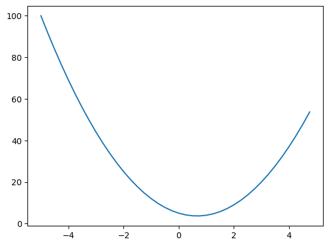

## Derivative of a function with a single variable

The goal is to get a good intuitive understanding of what a derviative is. Here we start with the derivative of a function of a single variable.

Lets define a scalar value function that takes a single scalar (variable) x and returns a scalar y.

$$
y = f(x)
$$
$$
f(x) = 3x^2 - 4x + 5
$$

So if we wrote this function out, it would look like:

$$
y = 3x^2 - 4x + 5
$$


```python
import math
import numpy as np
import matplotlib.pyplot as plt
%matplotlib inline
```

Lets define our function below:


```python
def f(x):
    return 3*x**2 - 4*x + 5
```

As an example, if we call this function with x = 3.0 (i.e. solve for x = 3.0) we get


```python
f(3.0)
```


    20.0


Lets apply this to a range of values of x. 
Lets create an vector of values for x, starting from -5 through 5 with a step of 0.25


```python
xs = np.arange(-5, 5, 0.25)
xs
```


    array([-5.  , -4.75, -4.5 , -4.25, -4.  , -3.75, -3.5 , -3.25, -3.  ,
           -2.75, -2.5 , -2.25, -2.  , -1.75, -1.5 , -1.25, -1.  , -0.75,
           -0.5 , -0.25,  0.  ,  0.25,  0.5 ,  0.75,  1.  ,  1.25,  1.5 ,
            1.75,  2.  ,  2.25,  2.5 ,  2.75,  3.  ,  3.25,  3.5 ,  3.75,
            4.  ,  4.25,  4.5 ,  4.75])


The values (y) for each x are as follows.  We also plot y for each x. Since the equation contains a squared value of x, we would expect the curve to be parabolic.


```python
ys = f(xs)
ys
```


    array([100.    ,  91.6875,  83.75  ,  76.1875,  69.    ,  62.1875,
            55.75  ,  49.6875,  44.    ,  38.6875,  33.75  ,  29.1875,
            25.    ,  21.1875,  17.75  ,  14.6875,  12.    ,   9.6875,
             7.75  ,   6.1875,   5.    ,   4.1875,   3.75  ,   3.6875,
             4.    ,   4.6875,   5.75  ,   7.1875,   9.    ,  11.1875,
            13.75  ,  16.6875,  20.    ,  23.6875,  27.75  ,  32.1875,
            37.    ,  42.1875,  47.75  ,  53.6875])


```python
plt.plot(xs, ys)
```


    [<matplotlib.lines.Line2D at 0x1167943b0>]


    

    


Next we want figure out what the derivative of this equation looks like.  The Wikipedia definition of a [deriviative](https://en.wikipedia.org/wiki/Derivative) is as follows:

Given a function $$f(x)$$ its derivative is written as

$$
\lim_{h \to 0} \frac{f(x+h) - f(x)}{h}
$$

_So if we bump up x at a particular point in the function by a very small value h, how does that function respond, i.e. by what sensitivitiy, basically the slope of the response at that point, how much does the function go up or down_


```python
h = 0.00001
x = 3.0
(f(x+h) - f(x))/h
```


    14.00003000000538


So at x = 3, the slope is 14 (you can get the same answer by manually plugging in x into the equation).  This means that the function responds postitively (i.e. going up to the right) 


```python
x = -3.0
(f(x+h) - f(x))/h
```


    -21.999970000052823


So at x = -3, the slope is 22 (again, you can get the same answer by manually plugging in x into the equation).  This means that the function responds negatively (i.e. going up to the left in the other direction) 

At a specific point (x = 2/3) the slope is zero (i.e. there is minimal response to incrementing x by h)


```python
x = 2/3
(f(x+h) - f(x))/h
```


    3.0000002482211127e-05


Summary: The derivative of a single valued function f(x) is just the slope of the function at each point x and indicates the sentivitiy of the function to change at that point. 

We will also refer to this as a gradient.

In the lesson "Derivative of a function with multiple variables" we will see how each variable affects the slope of the function (which would be a multi-dimensional curve)
