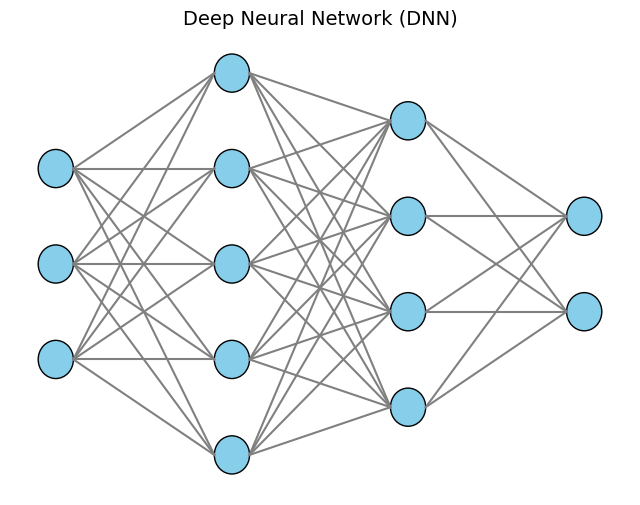
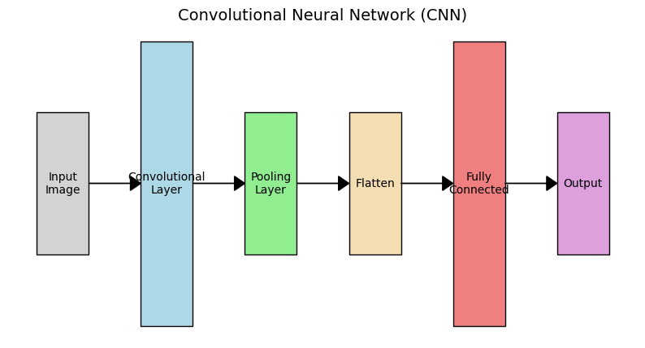
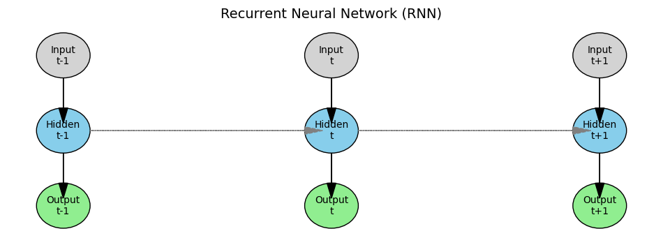

<script src="https://cdnjs.cloudflare.com/ajax/libs/mathjax/2.7.5/MathJax.js?config=TeX-MML-AM_CHTML" async></script>
<script type="text/x-mathjax-config">
MathJax.Hub.Config({
    tex2jax: {
        inlineMath: [['$','$'], ['\(','\)']],
        processEscapes: true
    }
});
</script>
## Types of Neural Networks - CNN, RNN, and DNN:

1. Deep Neural Network (DNN):
   - A DNN is a general term for neural networks with multiple layers between the input and output.
   - These layers allow the network to learn complex patterns by extracting higher-level features from raw input data.
   - DNNs can be applied to various types of data but don't have specialized structures for specific data types like images or sequences.

2. Convolutional Neural Network (CNN):
   - A CNN is a type of DNN specifically designed for processing grid-like data, such as images.
   - It uses convolutional layers that apply filters to local regions of the input, capturing spatial hierarchies and patterns.
   - CNNs are excellent at recognizing visual patterns, making them ideal for image and video recognition tasks.

3. Recurrent Neural Network (RNN):
   - An RNN is another type of DNN tailored for sequential data, like time series or natural language.
   - It has loops in its architecture, allowing information to persist and creating an internal "memory."
   - This design enables RNNs to consider previous inputs when making decisions, which is crucial for understanding context in sequences.

### Integration of Reinforcement Learning into DNNs for Large Language Models (LLMs):

- Reinforcement Learning (RL) is a learning paradigm where an agent learns to make decisions by performing actions and receiving feedback in the form of rewards or penalties.
- In the context of LLMs like GPT, RL is integrated through a process called Reinforcement Learning from Human Feedback (RLHF).

### How RLHF Works:

1. Pre-training the DNN:
   - The language model is initially trained on a large corpus of text data using unsupervised learning to predict the next word in a sentence.
   - This phase helps the model understand grammar, facts about the world, and some reasoning abilities.

2. Collecting Human Feedback:
   - Humans provide examples of desired outputs or rank different outputs generated by the model.
   - This feedback reflects human preferences and expectations for appropriate and useful responses.

3. Fine-tuning with RL:
   - The model is fine-tuned using RL algorithms like Proximal Policy Optimization (PPO).
   - A reward model is trained to predict human preferences based on the collected feedback.
   - The language model (the policy) is then optimized to maximize the rewards predicted by this reward model.
   - This process encourages the model to generate outputs that align with human values and preferences.

### Why Integrate RL into DNNs for LLMs:

- Aligning with Human Values:
  - RLHF helps the model produce responses that are not only statistically probable but also useful, safe, and aligned with human intentions.
- Improving Performance:
  - By optimizing for specific rewards, the model can perform better on tasks that require following instructions or maintaining a conversational tone.
- Handling Ambiguity:
  - RL allows the model to learn from trial and error, improving its ability to handle ambiguous or complex queries.

## Summary:

- DNNs are deep networks capable of learning complex patterns.
- CNNs specialize in spatial data like images using convolutional layers.
- RNNs specialize in sequential data by retaining information over time.
- Reinforcement Learning is integrated into DNNs for LLMs through RLHF, where human feedback guides the model to produce preferred outputs, enhancing alignment with human values and improving overall performance.


```python
import matplotlib.pyplot as plt
%matplotlib inline
```


```python
def draw_dnn():
    fig, ax = plt.subplots(figsize=(8, 6))
    ax.axis('off')

    # Define the number of neurons in each layer
    layers = [3, 5, 4, 2]  # Example: 1 input layer, 2 hidden layers, 1 output layer

    v_spacing = 1
    h_spacing = 2
    radius = 0.2

    for i, layer_size in enumerate(layers):
        x = i * h_spacing
        y_top = (max(layers) - layer_size) * v_spacing / 2

        for j in range(layer_size):
            y = y_top + j * v_spacing
            circle = plt.Circle((x, y), radius, fill=True, color='skyblue', ec='black')
            ax.add_patch(circle)

            if i > 0:
                prev_layer_size = layers[i - 1]
                y_prev_top = (max(layers) - prev_layer_size) * v_spacing / 2
                for k in range(prev_layer_size):
                    y_prev = y_prev_top + k * v_spacing
                    ax.plot([x - h_spacing + radius, x - radius], [y_prev, y], 'gray')

    plt.title('Deep Neural Network (DNN)', fontsize=14)
    plt.show()

draw_dnn()
```


    

    


Explanation:
  - Layers: The DNN consists of multiple layers—input, hidden, and output layers.
  - Neurons: Each circle represents a neuron.
  - Connections: Lines indicate full connections between neurons of adjacent layers.


```python
import matplotlib.patches as patches

def draw_cnn():
    fig, ax = plt.subplots(figsize=(10, 5))
    ax.axis('off')

    # Input image
    rect = patches.Rectangle((0, 2), 1, 1, linewidth=1, edgecolor='black', facecolor='lightgray')
    ax.add_patch(rect)
    ax.text(0.5, 2.5, 'Input\nImage', ha='center', va='center')

    # Convolution layer
    rect = patches.Rectangle((2, 1.5), 1, 2, linewidth=1, edgecolor='black', facecolor='lightblue')
    ax.add_patch(rect)
    ax.text(2.5, 2.5, 'Convolutional\nLayer', ha='center', va='center')

    # Pooling layer
    rect = patches.Rectangle((4, 2), 1, 1, linewidth=1, edgecolor='black', facecolor='lightgreen')
    ax.add_patch(rect)
    ax.text(4.5, 2.5, 'Pooling\nLayer', ha='center', va='center')

    # Flatten layer
    rect = patches.Rectangle((6, 2), 1, 1, linewidth=1, edgecolor='black', facecolor='wheat')
    ax.add_patch(rect)
    ax.text(6.5, 2.5, 'Flatten', ha='center', va='center')

    # Fully connected layer
    rect = patches.Rectangle((8, 1.5), 1, 2, linewidth=1, edgecolor='black', facecolor='lightcoral')
    ax.add_patch(rect)
    ax.text(8.5, 2.5, 'Fully\nConnected', ha='center', va='center')

    # Output layer
    rect = patches.Rectangle((10, 2), 1, 1, linewidth=1, edgecolor='black', facecolor='plum')
    ax.add_patch(rect)
    ax.text(10.5, 2.5, 'Output', ha='center', va='center')

    # Arrows
    positions = [1, 3, 5, 7, 9]
    for pos in positions:
        ax.arrow(pos, 2.5, 0.8, 0, head_width=0.1, head_length=0.2, fc='black', ec='black')

    plt.title('Convolutional Neural Network (CNN)', fontsize=14)
    plt.show()

draw_cnn()
```


    

    


Explanation:
  - Input Layer: Represents the input image.
  - Convolutional Layer: Applies filters to extract features.
  - Pooling Layer: Reduces spatial dimensions (downsampling).
  - Flatten Layer: Converts 2D feature maps to 1D feature vectors.
  - Fully Connected Layer: Processes features for classification.
  - Output Layer: Produces the final prediction.


```python
def draw_rnn():
    fig, ax = plt.subplots(figsize=(12, 4))
    ax.axis('off')

    # Time steps
    time_steps = ['t-1', 't', 't+1']
    h_spacing = 3
    v_positions = {'input': 2, 'hidden': 1, 'output': 0}
    v_spacing = 1
    radius = 0.3

    for i, t in enumerate(time_steps):
        x = i * h_spacing

        # Input node
        circle = plt.Circle((x, v_positions['input']), radius, fill=True, color='lightgray', ec='black')
        ax.add_patch(circle)
        ax.text(x, v_positions['input'], f'Input\n{t}', ha='center', va='center')

        # Hidden node
        circle = plt.Circle((x, v_positions['hidden']), radius, fill=True, color='skyblue', ec='black')
        ax.add_patch(circle)
        ax.text(x, v_positions['hidden'], f'Hidden\n{t}', ha='center', va='center')

        # Output node
        circle = plt.Circle((x, v_positions['output']), radius, fill=True, color='lightgreen', ec='black')
        ax.add_patch(circle)
        ax.text(x, v_positions['output'], f'Output\n{t}', ha='center', va='center')

        # Connections
        ax.arrow(x, v_positions['input'] - radius, 0, -v_spacing + radius*2, head_width=0.1, head_length=0.2, fc='black', ec='black')
        ax.arrow(x, v_positions['hidden'] - radius, 0, -v_spacing + radius*2, head_width=0.1, head_length=0.2, fc='black', ec='black')

        if i > 0:
            # Recurrent connection
            ax.arrow(x - h_spacing + radius, v_positions['hidden'], h_spacing - radius*2, 0, head_width=0.1, head_length=0.2, fc='gray', ec='gray', linestyle='--')

    plt.title('Recurrent Neural Network (RNN)', fontsize=14)
    plt.show()

draw_rnn()
```


    

    


Explanation:
  - Time Steps: The network is unfolded across multiple time steps.
  - Input Nodes: Receive input at each time step.
  - Hidden Nodes: Have recurrent connections (dashed arrows) to pass information forward in time.
  - Output Nodes: Produce output at each time step.
  - Connections: Solid arrows show data flow within a time step; dashed arrows represent the recurrent connections between time steps.
